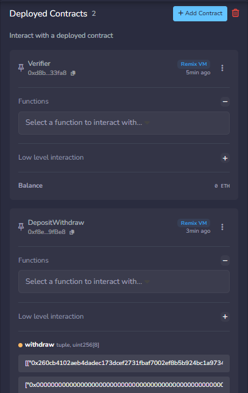
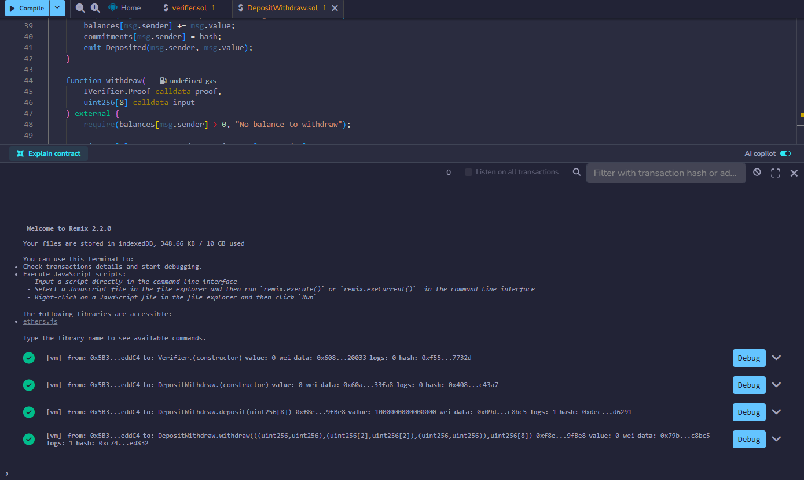
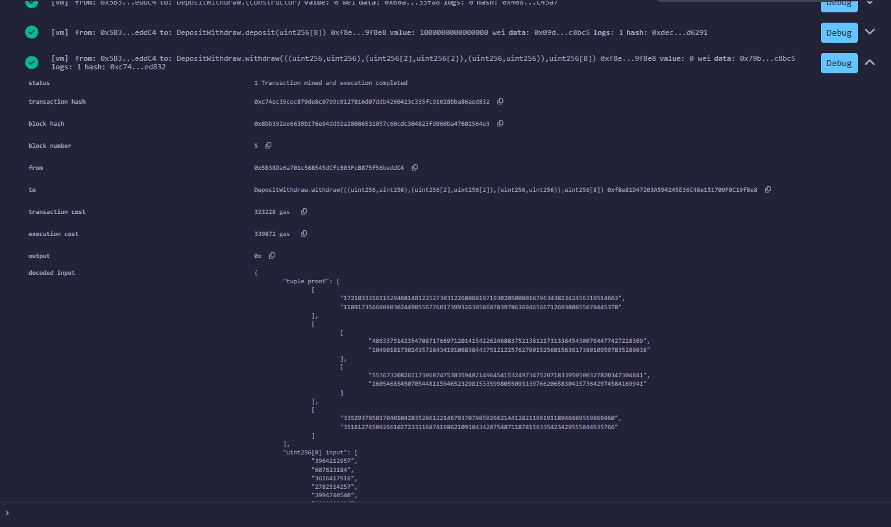
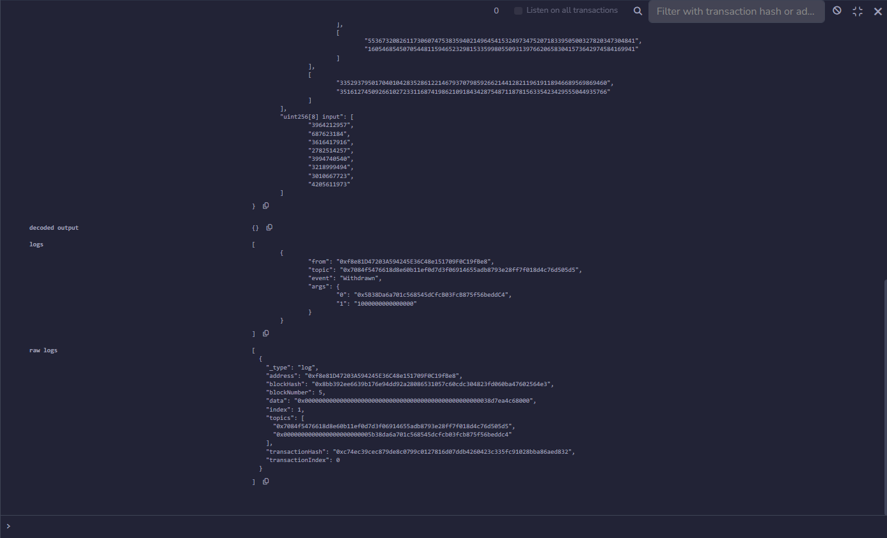

# Лабораторная работа 2. Депозит и вывод средств с ZK-верификацией

## Цель работы

Модифицировать смарт-контракт депозита и вывода средств: добавить хранение хеш-обязательства при депозите и проверку ZK-доказательства знания прообраза хеша при выводе средств.

## Используемые инструменты

- Solidity 0.8.25
- Remix IDE
- Верификатор из лабораторной работы 1 (ZoKrates Groth16, BN128)

## Архитектура решения

**`verifier.sol`** — смарт-контракт верификатор из лабораторной 1, проверяет ZK-доказательство знания прообраза SHA256.

**`DepositWithdraw.sol`** — основной контракт:
- При **депозите** принимает ETH и хеш секрета `uint256[8]`, привязывает хеш к адресу отправителя
- При **выводе** проверяет, что переданные публичные входы совпадают с сохранённым хешем, затем вызывает `verifyTx` верификатора; если результат `true` — переводит средства, иначе откатывает транзакцию

## Описание контракта

### Хранилище
```solidity
mapping(address => uint256) public balances;
mapping(address => uint256[8]) private commitments;
```

### Функция депозита
```solidity
function deposit(uint256[8] calldata hash) external payable
```
Принимает ETH (`msg.value > 0`) и хеш-обязательство. Хеш сохраняется в `commitments[msg.sender]`.

### Функция вывода
```solidity
function withdraw(IVerifier.Proof calldata proof, uint256[8] calldata input) external
```
1. Проверяет наличие баланса
2. Сравнивает `input` с сохранённым `commitments[msg.sender]`
3. Вызывает `verifier.verifyTx(proof, input)`
4. Если `true` — отправляет ETH на адрес вызывающего
5. Если `false` — `revert("Invalid zero-knowledge proof")`

## Порядок развёртывания в Remix IDE

### 1. Развернуть верификатор
- Открыть `verifier.sol` в Remix
- Скомпилировать (Solidity 0.8)
- Deploy → контракт **Verifier**
- Скопировать адрес задеплоенного верификатора

### 2. Развернуть DepositWithdraw
- Открыть `DepositWithdraw.sol` в Remix
- Скомпилировать
- Deploy → вставить адрес верификатора в поле конструктора `verifierAddress`

### 3. Вызов deposit
В поле `deposit` передать:
- `hash`: хеш из лабораторной 1 в формате uint256[8]
- `value`: сумма в wei (например, `1000000000000000` = 0.001 ETH)

```
hash: ["0x00000000000000000000000000000000000000000000000000000000ec4916dd","0x0000000000000000000000000000000000000000000000000000000028fc4c10","0x00000000000000000000000000000000000000000000000000000000d78e287c","0x00000000000000000000000000000000000000000000000000000000a5d9cc51","0x00000000000000000000000000000000000000000000000000000000ee1ae73c","0x00000000000000000000000000000000000000000000000000000000bfde08c6","0x00000000000000000000000000000000000000000000000000000000b37324cb","0x00000000000000000000000000000000000000000000000000000000faac8bc5"]
```

### 4. Вызов withdraw
В поле `withdraw` передать `proof` и `input` из `proof.json` лабораторной 1:

```
proof: [["0x260cb4102aeb4dadec173dcef2731fbaf7002ef8b5b924bc1a97346509819827","0x1a4a7bded2ecb74bd60cf74538dede4bdc9ac2cbc872b737ea182819e759e142"],[["0x0ac092a1e945f9ba40cd5f997f6e57bee5743f512be9fb5de5ec5e2cce731e95","0x17313b81f4dc0df9521e718367ef30f0b6751bc41da8d6b8a22463995d9461ce"],["0x0c3dade6f48fb9a79cb21e19ce2e15e0a790b7bb6732becaa1d187c7adc3eb89","0x038ca9ba05675deed21b57719b26c0bff5e99d749e4cafdc94d5fb5b4b60e5d5"]],["0x0769b214ad2c0a83eb9be5140e6bdc864df0e0f8d232666b4938a2eac8314e94","0x07c60ebfacffd4c0ab805d8260e8ca67eab17071ab11e1468c14c6891336e856"]]

input: ["0x00000000000000000000000000000000000000000000000000000000ec4916dd","0x0000000000000000000000000000000000000000000000000000000028fc4c10","0x00000000000000000000000000000000000000000000000000000000d78e287c","0x00000000000000000000000000000000000000000000000000000000a5d9cc51","0x00000000000000000000000000000000000000000000000000000000ee1ae73c","0x00000000000000000000000000000000000000000000000000000000bfde08c6","0x00000000000000000000000000000000000000000000000000000000b37324cb","0x00000000000000000000000000000000000000000000000000000000faac8bc5"]
```

## Результаты тестирования в Remix IDE

Оба контракта задеплоены в Remix VM (Cancun):



Все 4 транзакции выполнены успешно (deploy Verifier, deploy DepositWithdraw, deposit, withdraw):



Детали транзакции withdraw — статус `1 Transaction mined and execution completed`, событие `Withdrawn` в логах:



Логи транзакции withdraw с событием `Withdrawn` и суммой `1000000000000000` wei:


